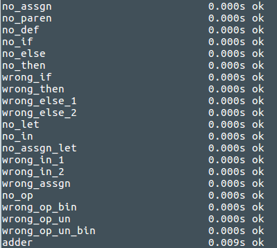

# Pracownia nr. 3
<i>Metody Programowania, semestr letni 2016/2017 II UWr</i>  
<i>Parser języka HDML </i>  
<i>Język Programowania: Prolog</i>  
 
 
Tresc zadania: <b>prac3.pdf</b>  
Testy poprawnościowe: <b>kamil_breczko_tests.pl</b>  
Rozwiązanie zadania: <b>kamil_breczko.pl</b>  
Sprawdzarka: <b>prac3.pl</b>  
 
 
 
Sprawdzaczkę należy uruchomić w katalogu w którym znajdują się testy i rozwiązanie, poleceniem:  
<i>swipl prac3.pl</i>

Za pomocą predykatu: 
<ul>
<li>run_test/1 uruchomienie pojedynczego testu </li>
<li>test_all/0 wszystkie testy</li>
</ul>

<b>Widok po uruchomieniu sprawdzarki:</b> 

