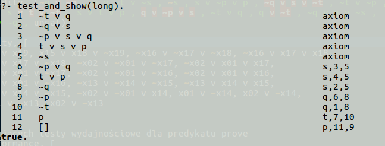

# Pracownia nr. 2
<i>Metody Programowania, semestr letni 2016/2017 II UWr</i>  
<i>Program obliczający rezolwentę dwóch klauzul oraz szukający rezolucyjnego dowodu sprzeczności. </i>  
<i>Język Programowania: Prolog</i>  
 

Sposób rozwiązania: 
<i>
Porządkowanie listy wejściowej. Usunięte zostaną tautologie, nadzbiory oraz klauzule, które zawierają zbędne literały. 
Podzielenie zbioru klauzul na zbiór o negatywnym wystąpieniu zmiennych - "NegativeTuples" oraz zbiór z resztą 
klauzul "RestTuples". Idea rozwiązania polega na wyprowadzaniu rezolwent z przesłanek znajdujących się w 
zbiorze  "NegativeTuples" oraz zbiorze "RestTuples".Predykat wybiera pierwszą klauzule z "NegativeTuples" i tworzy 
rezolwenty z klauzulami ze zbioru "RestTuples".  Powstałe rezolwenty są dołączane do odpowiadających 
sobie zbiorów. W każdym kolejnym kroku dana klauzula z "NegativeTuples" jest zapamiętywana zapobiegając
zapętleniu i odkładana. Program będzie próbował tworzyć nowe rezolwenty dopóki będzie istniała 
klauzula w "NegativeTuples". 
 
 
Uwaga: Listy klauzul jest posortowana względem długości klauzuli.  
Uwaga: Powstała rezolwenta nie może być tautologią. Także po każdej rezolwencie są usuwane nadzbiory.
</i>
 
 
 
 
 
Tresc zadania: <b>prac2.pdf</b>  
Testy poprawnościowe/wydajnościowe: <b>kamil_breczko_tests.pl</b>  
Rozwiązanie zadania: <b>kamil_breczko.pl</b>  
Sprawdzarka: <b>prac2.pl</b>  
 
 
 
Sprawdzaczkę należy uruchomić w katalogu w którym znajdują się testy i rozwiązania, poleceniem:  
<i>swipl prac2.pl</i>

Za pomocą predykatu: 
<ul>
<li>test_and_show/1 można uruchomić pojedynczy test z  wyprodukowanym dowodem</li>
<li>test_all/0 wszystkie testy</li>
</ul>

<b>Widok po uruchomieniu sprawdzarki:</b> 

