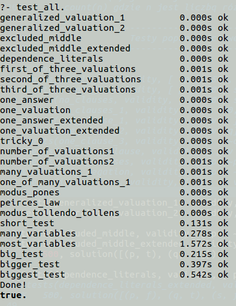

# Program szukający wartościowań spełniających zadany zbiór klauzul 
<i>Język Programowania: Prolog</i>
 
 
Sposób rozwiązania: 
<i>
 1. Wstępne przesortowanie klauzul. 
 2. Nadanie wartościowań zmiennym tym, które występują jako pojedynczy literał w klauzuli.
 3. Sprawdzanie spełnialności klauzul złożonych z kilka literałów względem literałów które już nadano wartość. 
    Wyjmowane są te klauzule z listy które są zawsze spełnialne a literały z niej zapamiętane, nadając wartość 
 ogólną 'x'. 
 4. Zmiennym, w klauzulach, które pozostały w liście zostaną nadane wartościowania. W każdym kroku
 sprawdzając czy inna klauzula jest już spełanialna (postępując jak w kroku 3).
</i>
 
 
 
 
 

Tresc zadania: [prac1.pdf](./prac1.pdf)  
Testy poprawnościowe/wydajnościowe: [kamil_breczko_tests.pl](./kamil_breczko_tests.pl) 
Rozwiązanie zadania: [kamil_breczko_solver.pl](./kamil_breczko_solver.pl)  
Sprawdzarka: [prac1.pl](./prac1.pl)  
 
 
 

Sprawdzaczkę należy uruchomić w katalogu w którym znajdują się testy i rozwiązania, poleceniem:  
<i>swipl prac1.pl</i>

Za pomocą predykatu: 
<ul>
<li>run_test/1 można uruchomić pojedynczy test</li>
<li>test_all/0 wszystkie testy</li>
</ul>

<b>Widok po uruchomieniu sprawdzarki:</b> 

